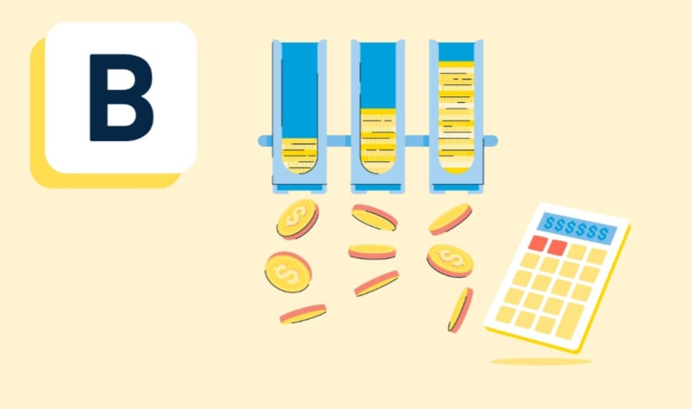

)

<h1 style="color: #9EDDFF;">BudgetBuddy</h1>

 

<b>Budget buddy</b> is a personal finance application designed to simplify budget management and financial tracking. Whether you're an individual, a family, or a small business owner, BudgetBuddy provides you with the tools you need to stay on top of your finances.

<h2>Project Description</h2>

"BudgetBuddy" is an application that helps users to manage their budgets and track their transactions. The application provides a secure and user-friendly platform for individuals to track their income, expenses, and savings goals.

Using JWT authentication, users can securely register and log in to their accounts, ensuring their financial information remains protected. The application allows users to create multiple budget categories and allocate funds accordingly. Users can then input their expenses and income, categorize them, and track their spending habits.

With the help of MongoDB as the database, "BudgetBuddy" securely stores user data, including budgets, transactions, and user preferences. The application ensures data integrity and provides reliable access to user information.

Overall, "BudgetBuddy" aims to simplify personal finance management, promote responsible spending, and help users achieve their financial goals.

<h2>Features</h2>

- <strong>Secured Information</strong>: Utilizing JWT authentication, BudgetBuddy ensures the security and privacy of your financial data. Register and log in with confidence, knowing your information is protected.

- <strong>Multi-Category Budgeting</strong>: Create and manage multiple budget categories to allocate funds for different aspects of your life or business.

- <strong>Expense and Income Tracking</strong>: Log your expenses and income, categorize them effortlessly, and gain insight into your financial transactions.

- <strong>Spending Analysis</strong>: Visualize your spending habits with easy-to-read charts and graphs. Identify areas where you can save and make informed financial decisions.

- <strong>Transaction History</strong>: Access your transaction history to keep a detailed record of your financial activities.

- <strong>Savings Goals</strong>: Set and track savings goals to help you achieve your financial objectives.

<h2>Coming Soon...</h2>

<strong>Exciting Updates Ahead:</strong> We're currently working on several new features and improvements for our project. Here's a sneak peek:

<ul>
  <li>Enhanced functionality</li>
  <li>Improved user interface</li>
  <li>New customization options</li>
</ul>

Stay tuned for these exciting changes!

## Thanks to all the Contributors ❤️

